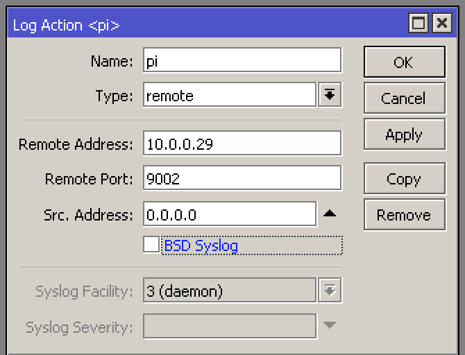
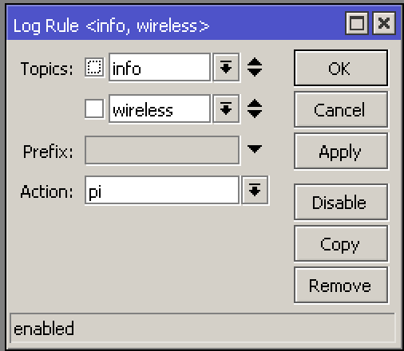

# Wifi Presence

Detect if Wifi device is present by listening for Mikrotik logs.

State is synchronized with MQTT broker using Home Assistant compatible auto-discovery protocol.

# Build and usage

1. Add MAC addresses and names of devices you want to track in main.go `var devices`
2. Modify MQTT_ADDRESS if necessary
3. Configure router to output wireless logs to your machine (Raspberry PI in my case):
  - Go to *System->Logging*
  - Create new Action with type *Remote* and address pointing to your machine (port 9002)

    

  - Create new Rule with topics Info,Wireless and select previously created Action

    

4. Build script `go build .`
5. Run it `./wifi-presence`

Script doesn't read initial state from router - devices will be reported after being connected/disconnected from network.

Running as daemon is not supported - either run in using tmux/screen or create [Systemd script](https://github.com/philippe44/AirConnect#start-automatically-in-linux) which would handle it for you

# Author

Jakub Czekański